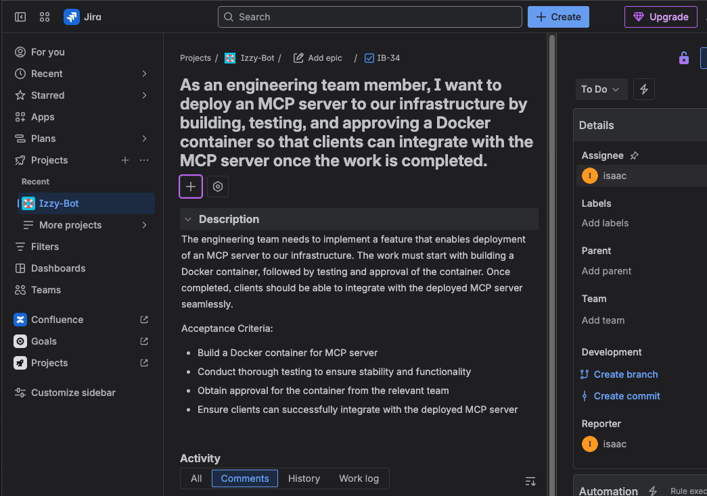

# Solesonic LLM UI

A React-based user interface for the Solesonic LLM chat application. This project provides a modern, responsive web interface for interacting with the Solesonic LLM API, with real-time streaming and elicitation-driven workflows.

## Table of Contents

- [Features](#features)
- [Getting Started](#getting-started)
  - [Prerequisites](#prerequisites)
  - [Installation](#installation)
- [Environment Variables](#environment-variables)
- [Production Deployment](#production-deployment)
- [Project Structure](#project-structure)
- [Architecture Overview](#architecture-overview)
  - [Chat Streaming](#chat-streaming)
  - [Elicitation Flow](#elicitation-flow)
- [API & Services](#api--services)
  - [ChatService](#chatservice)
  - [StreamService](#streamservice)
  - [ElicitationService](#elicitationservice)
- [Example Usage](#example-usage)
- [License](#license)

## Features

- Realtime chat UI for interacting with Solesonic LLM
- Elicitation prompts (assistant asks for missing info and collects fields)
- Server-Sent Events (SSE) streaming for low-latency responses
- User authentication via AWS Cognito (with optional mock mode)
- Document upload and management
- Atlassian integrations (e.g., Jira) via backend intents
- Responsive design for desktop and mobile

## Getting Started

### Prerequisites

- Node.js (LTS version recommended)
- npm or yarn
- Access to AWS Cognito for authentication (or use mock mode)

### Installation

1. Clone the repository:
   ```bash
   git clone <repository-url>
   cd solesonic-llm-ui
   ```

2. Install dependencies:
   ```bash
   npm install
   ```

3. Configure environment variables:
   Create a `.env` file in the project root with values appropriate for your environment. See [Environment Variables](#environment-variables) for details.

4. Start the development server:
   ```bash
   npm run dev
   ```

5. Open your browser and navigate to http://localhost:3000

## Environment Variables

The UI is configured via Vite environment variables:

- `VITE_API_BASE_URI` — Base URI of the backend API (e.g., `http://localhost:8080/api`)
- `VITE_UI_BASE_URI` — Base URI of this UI (used for redirects)
- `VITE_MOCK_AMPLIFY` — Optional; set to `true` to mock Amplify/Cognito during local development
- `VITE_MOCK_API` — Optional; set to `true` to mock API responses during local development

Example `.env`:

```
VITE_API_BASE_URI=http://localhost:8080/api
VITE_UI_BASE_URI=http://localhost:3000
VITE_MOCK_AMPLIFY=true
VITE_MOCK_API=true
```

## Production Deployment

For production deployment using Docker and Nginx, see [README.docker.md](README.docker.md).

## Project Structure

- `src/` — Source code
  - `chat/` — Chat interface components
  - `elicitation/` — Elicitation UI components (dynamic prompts/forms)
  - `service/` — Service layer for API communication and streaming
  - `client/` — HTTP client configuration
  - `properties/` — Application configuration (URIs, etc.)
  - `util/` — Utility functions
- `docs/` — Additional documentation (e.g., Elicitation feature)

## Architecture Overview

The UI communicates with the Solesonic backend using REST and SSE streaming. Authentication is handled via AWS Cognito (or mock mode locally). Core flows:

### Chat Streaming

- Initiated via `ChatService.chatStream(...)`
- Uses `@microsoft/fetch-event-source` to receive SSE frames
- Supported server events:
  - `init` — initial payload that may include the `chatId`
  - `chunk` / `message` — incremental content for the assistant’s reply
  - `elicitation` — request for more information from the user with a JSON schema
  - `done` — end of assistant’s reply, with final metadata

### Elicitation Flow

Elicitation enables the assistant to request missing parameters through a structured prompt.

High-level steps:

1. The backend sends an `elicitation` SSE event with a `requestedSchema` and `message`.
2. The UI renders an elicitation form using `src/elicitation/ElicitationPrompt.jsx`.
3. The user fills fields or clicks a boolean choice (accept/decline/cancel).
4. `ElicitationService.handleElicitationSubmit(...)` constructs an `elicitationResponse` payload.
5. `StreamService.chatStreamElicitationResponse(...)` posts the response to the backend and streams the assistant’s follow-up message.
6. `ChatService.handleStreamChunk(...)` appends streamed content until `done`.

See the dedicated doc: [docs/ELICITATION.md](docs/ELICITATION.md).

## API & Services

Runtime endpoints are derived from `src/properties/ApplicationProperties.jsx`:

- `chatsUri = ${VITE_API_BASE_URI}/chats`
- `streamingChatsUri = ${VITE_API_BASE_URI}/streaming/chats`
- `usersUri = ${VITE_API_BASE_URI}/users`
- `ollamaUri = ${VITE_API_BASE_URI}/ollama`
- `atlassianUri = ${VITE_API_BASE_URI}/atlassian`

### ChatService

- `chatStream(message, chatId, { onChunk, onDone, signal })` — starts/continues a chat stream (SSE)
- `handleStreamChunk(event, handlers)` — helper to process `init`, `chunk/message`, `elicitation`, and `done`
- `findChatDetails(chatId)` — fetch chat metadata
- `findChatHistory()` — fetch recent chats for the authenticated user

Server events processed by `handleStreamChunk` include `ELICITATION` which opens the elicitation UI and seeds default values.

### StreamService

- `chatStreamElicitationResponse(payload, chatId, elicitationId, { onChunk, timeoutMs })` — submits elicitation responses and streams the assistant’s reply via SSE to
  `POST ${streamingChatsUri}/{chatId}/{elicitationId}/elicitation-response`
- `handleStreamError(error, setError, setChatHistory)` — utility to unwind partial AI messages on failure

### ElicitationService

- `handleElicitationChange(fieldName, value, setElicitationValues)` — update form state
- `handleElicitationSubmit({ overrideFields, activeElicitation, elicitationValues, ... })` —
  builds `elicitationResponse` and invokes `StreamService.chatStreamElicitationResponse(...)`

Example elicitation response payload:

```json
{
  "elicitationResponse": {
    "name": "<elicitation-name>",
    "fields": {
      "<fieldA>": "value",
      "<fieldB>": "value"
    }
  }
}
```

## Security Considerations

- Never commit your `.env` file to version control
- Use environment-specific variables for different deployment environments
- Keep AWS Cognito credentials secure
- Use HTTPS in production environments


# Example Usage

### Jira Integration Showcase

The following example demonstrates how the Solesonic LLM API can automatically create Jira issues based on natural language requests:

### **User Prompt:**


### **Resulting Jira Issue:**



In this example:
1. The user describes a need to deploy an MCP server using natural language
2. The system automatically detects the `CREATING_JIRA_ISSUE` intent
3. It creates a properly formatted Jira issue (IB-34) with:
    - User story format following best practices
    - Detailed description and acceptance criteria
    - Proper assignment to the specified user (Isaac)
    - Direct link to the created issue

This showcases the power of intent-based prompting and seamless Atlassian integration without requiring users to know specific Jira API calls or formatting.

## License

This project is licensed under the Apache License, Version 2.0 - see the [LICENSE](LICENSE) file for details.

```
Copyright 2025 Solesonic

Licensed under the Apache License, Version 2.0 (the "License");
you may not use this file except in compliance with the License.
You may obtain a copy of the License at

    http://www.apache.org/licenses/LICENSE-2.0

Unless required by applicable law or agreed to in writing, software
distributed under the License is distributed on an "AS IS" BASIS,
WITHOUT WARRANTIES OR CONDITIONS OF ANY KIND, either express or implied.
See the License for the specific language governing permissions and
limitations under the License.
```

For more information about the Apache License, Version 2.0, please visit: [https://www.apache.org/licenses/LICENSE-2.0](https://www.apache.org/licenses/LICENSE-2.0)
