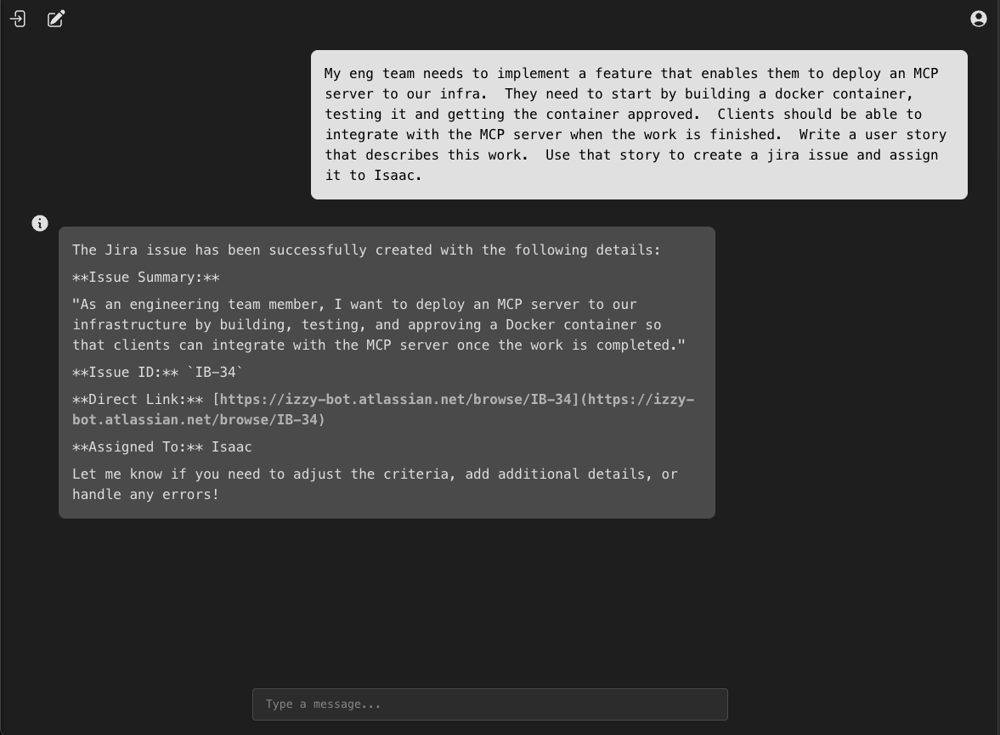
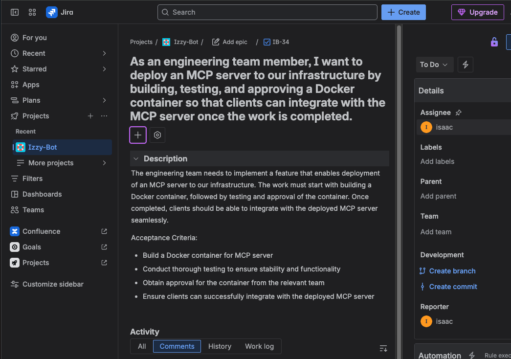

# Solesonic LLM UI

A React-based user interface for the Solesonic LLM chat application. This project provides a modern, responsive web interface for interacting with the Solesonic LLM API, with real-time streaming and elicitation-driven workflows.

## Table of Contents

- [Features](#features)
- [Getting Started](#getting-started)
  - [Prerequisites](#prerequisites)
  - [Installation](#installation)
  - [Component Development (Storybook)](#component-development-storybook)
- [Environment Variables](#environment-variables)
- [Production Deployment](#production-deployment)
- [Project Structure](#project-structure)
- [Architecture Overview](#architecture-overview)
  - [Chat Streaming](#chat-streaming)
  - [Elicitation Flow](#elicitation-flow)
- [API & Services](#api--services)
  - [ChatService](#chatservice)
  - [StreamService](#streamservice)
  - [ElicitationService](#elicitationservice)
  - [SlashCommandService](#slashcommandservice)
  - [OllamaService](#ollamaservice)
  - [UserPreferencesService](#userpreferencesservice)
- [Example Usage](#example-usage)
- [License](#license)

## Features

- Realtime chat UI for interacting with Solesonic LLM
- Elicitation prompts (assistant asks for missing info and collects fields)
- Server-Sent Events (SSE) streaming for low-latency responses
- User authentication via Keycloak
- Slash commands with auto-completion and command suggestions
- Model configuration UI for managing Ollama and other models
- User preferences and settings management
- RAG (Retrieval Augmented Generation) management for custom training
- Persistent notifications for workflow updates
- Document upload and management
- Atlassian integrations (e.g., Jira) via backend intents
- Responsive design for desktop and mobile

## Getting Started

### Prerequisites

- Node.js (LTS version recommended)
- npm or yarn
- Access to a Keycloak server for authentication

### Installation

1. Clone the repository:
   ```bash
   git clone <repository-url>
   cd solesonic-llm-ui
   ```

2. Install dependencies:
   ```bash
   npm install
   ```

3. Configure environment variables:
   Create a `.env` file in the project root with values appropriate for your environment. See [Environment Variables](#environment-variables) for details.

4. Start the development server:
   ```bash
   npm run dev
   ```

5. Open your browser and navigate to http://localhost:3000

### Component Development (Storybook)

To build or preview individual components without a running backend, Keycloak, or network
connection, use Storybook:

```bash
npm run storybook
```

Open your browser and navigate to http://localhost:6006. See [docs/STORYBOOK.md](docs/STORYBOOK.md)
for how it's configured and how to write a story.

## Environment Variables

The UI is configured via Vite environment variables. Required for Keycloak authentication:

- `VITE_API_BASE_URI` — Base URI of the backend API (e.g., `http://localhost:8080/api`)
- `VITE_UI_BASE_URI` — Base URI of this UI (used for redirects)
- `VITE_KEYCLOAK_URL` — URL of your Keycloak server (e.g., `http://localhost:8080`)
- `VITE_KEYCLOAK_REALM` — Keycloak realm name
- `VITE_KEYCLOAK_CLIENT_ID` — Keycloak client ID for this application

Example `.env`:

```
VITE_API_BASE_URI=http://localhost:8080/api
VITE_UI_BASE_URI=http://localhost:3000
VITE_KEYCLOAK_URL=http://localhost:8080
VITE_KEYCLOAK_REALM=solesonic
VITE_KEYCLOAK_CLIENT_ID=solesonic-ui
```

## Production Deployment

For production deployment using Docker and Nginx, see [README.docker.md](README.docker.md).

## Project Structure

- `src/` — Source code
  - `chat/` — Chat interface: screen shell and history sidebar, plus `message/`, `composer/`, `command/`, and `attachment/` subdirectories
  - `elicitation/` — Elicitation UI components (dynamic prompts/forms)
  - `user/` — User settings, preferences, and model configuration UI
  - `train/` — RAG management for custom training/knowledge base
  - `service/` — Service layer for API communication (chat, streaming, auth, etc.)
  - `client/` — HTTP client configuration
  - `properties/` — Application configuration (URIs, etc.)
  - `config/` — Environment and framework configuration (Keycloak)
  - `context/` — React Context for shared state
  - `authorizer/` — Authentication and authorization components
  - `providers/` — Context providers
  - `hooks/` — Custom React hooks
  - `util/` and `utils/` — Utility functions
  - `common/` — Shared UI components
- `docs/` — Additional documentation

## Architecture Overview

The UI communicates with the Solesonic backend using REST and SSE streaming. Authentication is handled via Keycloak, which provides secure token-based access. Core flows:

### Chat Streaming

- Initiated via `ChatService.chatStream(...)`
- Uses a plain `fetch` plus `src/client/parseSseStream.js`, an async generator over the
  response body, to receive SSE frames. (`@microsoft/fetch-event-source` is still a dependency
  but is no longer used.)
- Every frame is an [AG-UI](https://docs.ag-ui.com) event, routed by `ChatService.handleStreamChunk`:
  - `RUN_STARTED` — first frame of every turn; `threadId` is the chat id and the persisted user
    message's id is on `input.messages`
  - `TEXT_MESSAGE_CONTENT` — incremental assistant text in `delta` (`TEXT_MESSAGE_START`/`END`
    bracket it and carry a wire-only `messageId`)
  - `TOOL_CALL_START` / `TOOL_CALL_ARGS` / `TOOL_CALL_END` — an elicitation; see
    [docs/ELICITATION.md](docs/ELICITATION.md)
  - `CUSTOM` — `progress` (the message’s step log), `attachment` (per-attachment outcome keyed by
    `attachmentId`), `image` (a generated image reference), `failure` (an error message, not
    terminal), `cancel` (marker before a cancelled turn’s `RUN_FINISHED`)
  - `RUN_FINISHED` — terminal; `result` is the structured chat response
  - `RUN_ERROR` — terminal; `message` is user-facing, and no `RUN_FINISHED` follows

### Attachments

Users can attach up to four files per message by pasting into the composer, dropping onto it,
or using the paperclip button. Accepted types (`src/util/imageValidation.js`) are PNG, JPEG,
GIF, WebP, PDF, plain text, Markdown, HTML, CSV, XML, JSON and RTF, up to 20MB each. Images over
5MB are downscaled client-side (`src/util/downscaleImage.js`) because that is the limit the
vision model can read; non-image files are uploaded as-is. Animated GIFs are never downscaled —
canvas re-encoding would flatten them to a single frame. Attachments whose type cannot be
previewed render as a generic file icon (`AttachmentThumbnail`) rather than a thumbnail.

Flow:

1. Each selected file is uploaded immediately to `POST /attachments`
   (`src/service/AttachmentService.js`) and appears in the composer tray
   (`src/hooks/useAttachmentTray.js`). Removing one issues a `DELETE`.
2. A caption is stored as the attachment’s `description`. The backend only accepts it on the
   initial multipart upload, so a caption typed after staging is committed on send by
   re-staging the file and deleting the superseded copy. The new upload always completes
   before the old id is deleted, so a failure loses the caption rather than the file.
3. On send, the staged ids go out as `attachmentIds` on the chat payload — omitted entirely
   when nothing is attached.
4. The tray is cleared only once a `RUN_STARTED` frame arrives. If the stream ends without one,
   nothing was bound server-side, so the ids are still valid: the message text and the tray are
   both restored for a retry.
5. Sent attachments render on their `USER` bubble via `MessageAttachments`, resolving through a
   ref-counted blob-URL cache (`src/util/attachmentObjectUrlCache.js`) so a file is fetched
   at most once and an optimistic bubble reuses the bytes it already has. Clicking an image
   thumbnail opens a focus-trapped lightbox; non-image attachments have no lightbox.

Staged ids are kept in `sessionStorage` scoped by chat id and revalidated against the server on
restore, so a reload does not resurrect an attachment the backend has already discarded.

### Elicitation Flow

Elicitation enables the assistant to request missing parameters through a structured prompt.

High-level steps:

1. The backend streams an AG-UI tool call; `TOOL_CALL_ARGS.delta` carries the `requestedSchema` and `message`.
2. The UI renders an elicitation form using `src/elicitation/ElicitationPrompt.jsx`.
3. The user fills fields or clicks a boolean choice (accept/decline/cancel).
4. `ElicitationService.handleElicitationSubmit(...)` builds an AG-UI `ToolMessage` whose `content` names the action.
5. `StreamService.chatStreamElicitationResponse(...)` posts it; the answer resumes the parked tool call server-side.
6. The follow-up streams in on the same connection and `ChatService.handleStreamChunk(...)` appends it until `RUN_FINISHED`.

See the dedicated doc: [docs/ELICITATION.md](docs/ELICITATION.md).

## API & Services

Runtime endpoints are derived from `src/properties/ApplicationProperties.jsx`:

- `chatsUri = ${VITE_API_BASE_URI}/chats` — Chat history and metadata
- `streamingChatsUri = ${VITE_API_BASE_URI}/streaming/chats` — Streaming chat and elicitation responses
- `usersUri = ${VITE_API_BASE_URI}/users` — User profile and preferences
- `ollamaUri = ${VITE_API_BASE_URI}/ollama` — Model management and configuration
- `atlassianUri = ${VITE_API_BASE_URI}/atlassian` — Jira and Atlassian integrations
- `slashCommandsUri = ${VITE_API_BASE_URI}/slash/commands` — Slash command suggestions

### ChatService

- `chatStream(message, chatId, { onChunk, onDone, signal })` — initiates or continues a chat stream via SSE
- `handleStreamChunk(event, handlers)` — routes AG-UI events: `RUN_STARTED`, `TEXT_MESSAGE_CONTENT`, `TOOL_CALL_ARGS`, `CUSTOM`, `RUN_FINISHED`, and `RUN_ERROR`
- `findChatDetails(chatId)` — retrieves chat metadata
- `findChatHistory({ page, size })` — fetches one page of the authenticated user's chats (newest first) from the Spring `Pageable` endpoint, flattened to `{ chats, page, last, totalPages, totalElements }`. The history drawer pages through it with `usePagedChatHistory`, which loads the next page as an infinite-scroll sentinel comes into view.

An elicitation arrives as `TOOL_CALL_ARGS`, which opens the elicitation form with a JSON schema and message.

### StreamService

- `chatStreamElicitationResponse(toolMessage, chatId, elicitationId, { onChunk, timeoutMs })` — posts the elicitation answer; the follow-up continues on the stream already open
- `handleStreamError(error, setError, setChatHistory)` — cleans up partial AI messages on stream errors

### ElicitationService

- `handleElicitationChange(fieldName, value, setElicitationValues)` — updates form field state
- `handleElicitationSubmit({ overrideFields, activeElicitation, elicitationValues, ... })` — builds and submits the AG-UI `ToolMessage` answer
- `resolveElicitationAction(fields)` — derives the `accept`/`decline`/`cancel` action the backend reads

Example elicitation answer (`content` is a JSON string; only `action` reaches the MCP tool):

```json
{
  "id": "b8e2…",
  "role": "tool",
  "toolCallId": "9c41…",
  "content": "{\"action\":\"accept\"}"
}
```

### SlashCommandService

- `fetchCommands(command)` — fetches available slash command suggestions, optionally filtered by partial command text

### OllamaService

- `models()` — lists all configured models
- `getModel(id)` — retrieves details for a specific model
- `createModel(model)` — creates a new model configuration
- `updateModel(id, model)` — updates an existing model configuration
- `installedModels()` — lists currently installed Ollama models

### UserPreferencesService

- `get()` — retrieves the authenticated user’s preferences
- `save(userPreferences)` — saves or updates user preferences
- `update(userPreferences)` — updates specific preference fields

## Security Considerations

- Never commit your `.env` file to version control
- Use environment-specific variables for different deployment environments
- Keep Keycloak credentials and connection details secure
- Use HTTPS in production environments


# Example Usage

### Jira Integration Showcase

The following example demonstrates how the Solesonic LLM API can automatically create Jira issues based on natural language requests:

### **User Prompt:**



### **Resulting Jira Issue:**



In this example:
1. The user describes a need to deploy an MCP server using natural language
2. The system automatically detects the `CREATING_JIRA_ISSUE` intent
3. It creates a properly formatted Jira issue (IB-34) with:
    - User story format following best practices
    - Detailed description and acceptance criteria
    - Proper assignment to the specified user (Isaac)
    - Direct link to the created issue

This showcases the power of intent-based prompting and seamless Atlassian integration without requiring users to know specific Jira API calls or formatting.

## License

This project is licensed under the Apache License, Version 2.0 - see the [LICENSE](LICENSE) file for details.

```
Copyright 2025 Solesonic

Licensed under the Apache License, Version 2.0 (the "License");
you may not use this file except in compliance with the License.
You may obtain a copy of the License at

    http://www.apache.org/licenses/LICENSE-2.0

Unless required by applicable law or agreed to in writing, software
distributed under the License is distributed on an "AS IS" BASIS,
WITHOUT WARRANTIES OR CONDITIONS OF ANY KIND, either express or implied.
See the License for the specific language governing permissions and
limitations under the License.
```

For more information about the Apache License, Version 2.0, please visit: [https://www.apache.org/licenses/LICENSE-2.0](https://www.apache.org/licenses/LICENSE-2.0)
